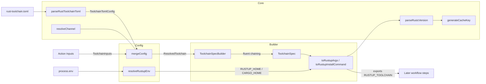
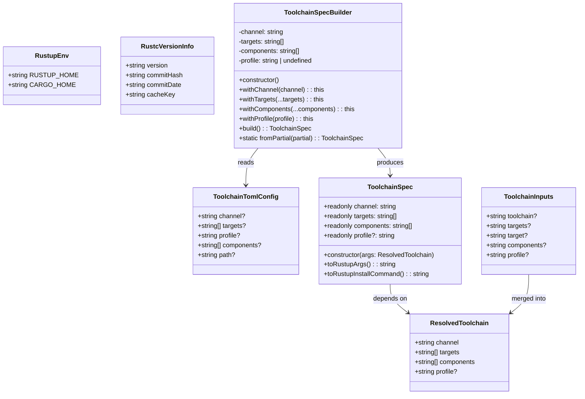
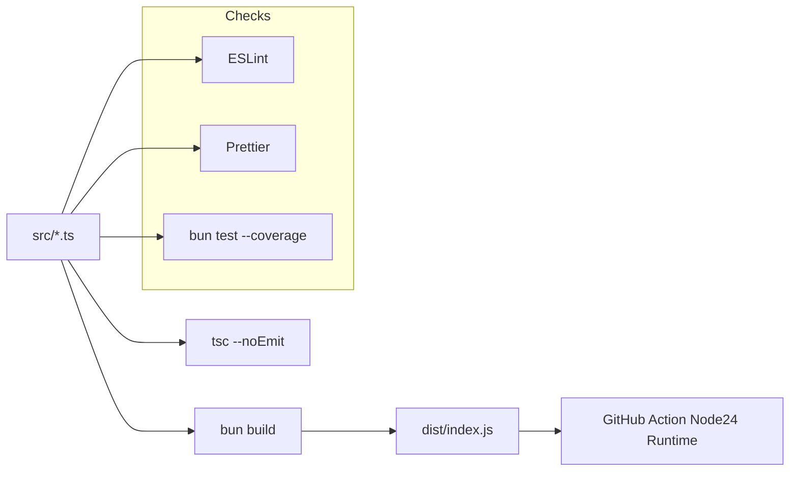
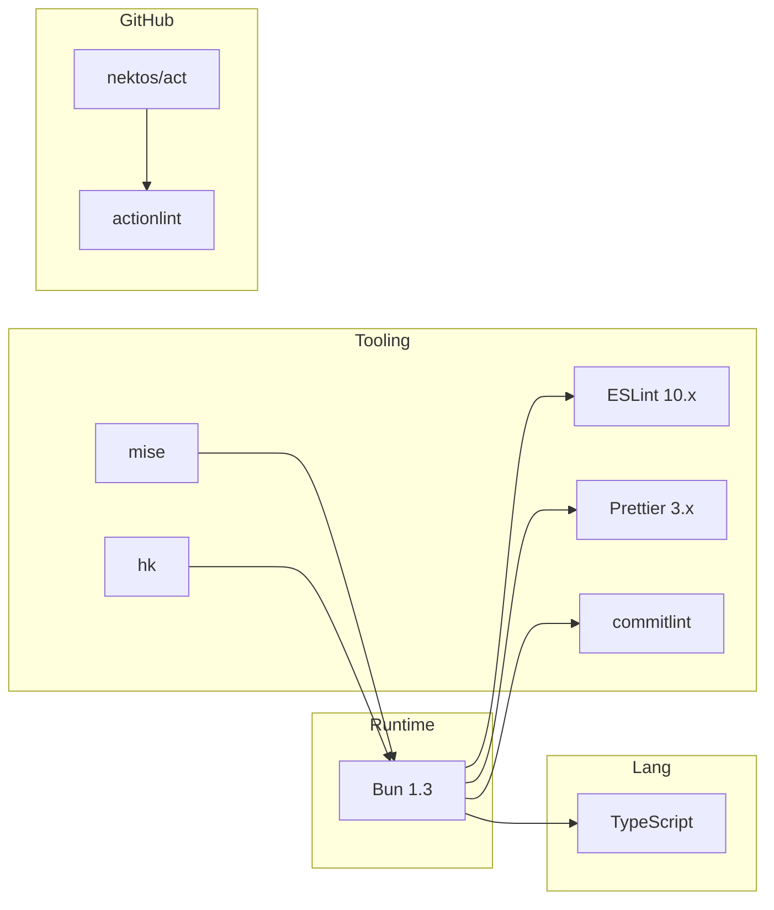

# Architecture

## Overview

A TypeScript library for reading `rust-toolchain.toml` and building `rustup` toolchain install commands, designed as a GitHub Action component. Inspired by [dtolnay/rust-toolchain](https://github.com/dtolnay/rust-toolchain).

```text
GitHub Actions Runner
        |
  ┌─────┴────────┐
  │  action.yml  │  runs: node24, main: dist/index.js
  └─────┬────────┘
        │
  ┌─────┴─────────────┐
  │  src/index.ts     │  Entry script — @actions/core
  │                   │  getInput/setOutput/setFailed
  └───┬───┬────┬──────┘
      │   │    │
  ┌───┘   └┐   └──────┐
  v        v          v
┌───────┐ ┌──────┐ ┌────────┐
│ core  │ │config│ │ builder│
└───┬───┘ └──┬───┘ └───┬────┘
    │        │         │
    └────┬───┘         │
         v             v
    ┌────────────┐ ┌──────────┐
    │ resolve/   │ │ Toolchain│
    │ merge/parse│ │ Spec     │
    └────────────┘ └────┬─────┘
                        │
                        v
                   ┌──────────┐
                   │ rustup   │
                   │ install  │
                   └──────────┘
```

## Module Dependency Graph

```mermaid
graph TD
    subgraph "Source Layer"
        A[src/core.ts]
        B[src/config.ts]
        C[src/builder.ts]
        I[src/index.ts]
    end

    subgraph "Build Output"
        E[dist/index.js]
    end

    subgraph "External"
        TK[@actions/core]
    end

    subgraph "Tests"
        F[src/core.test.ts]
        G[src/config.test.ts]
        H[src/builder.test.ts]
    end

    I --> A
    I --> B
    I --> C
    I --> TK
    C --> A
    C --> B
    B --> A
    I --> E
    F --> A
    G --> B
    H --> C
```

## Data Flow



## Class Hierarchy



## Source File Map

| File             | Type                       | Exports                                                                                    | Responsibilities                                                                                                                                       |
| ---------------- | -------------------------- | ------------------------------------------------------------------------------------------ | ------------------------------------------------------------------------------------------------------------------------------------------------------ |
| `src/index.ts`   | Entry (node:child_process) | none — side-effecting script                                                               | GitHub Action entry via `@actions/core` — reads inputs/TOML, installs the toolchain, adds targets/components, exports `RUSTUP_TOOLCHAIN`, sets outputs |
| `src/core.ts`    | Module (smol-toml)         | `parseRustToolchainToml`, `resolveChannel`, `generateCacheKey`, `parseRustcVersion`, types | TOML parsing, channel string resolution, cache key computation                                                                                         |
| `src/config.ts`  | Module                     | `mergeConfig`, `resolveRustupEnv`, types                                                   | Merge toml config with action inputs (inputs win); resolve `RUSTUP_HOME`/`CARGO_HOME`, honouring caller-supplied values                                |
| `src/builder.ts` | Classes                    | `ToolchainSpec`, `ToolchainSpecBuilder`                                                    | Fluent builder pattern, rustup command generation                                                                                                      |

There is no barrel export. Programmatic consumers import `src/core.ts`,
`src/config.ts`, and `src/builder.ts` directly; `src/index.ts` is the action
entry point and exports nothing.

## Build Pipeline



## Testing Strategy

All tests use Bun's built-in test runner with 100% coverage enforced by `bunfig.toml`.

| File                  | Tests                                                                                                                                      | Coverage Target                   |
| --------------------- | ------------------------------------------------------------------------------------------------------------------------------------------ | --------------------------------- |
| `src/core.test.ts`    | `parseRustToolchainToml`, `resolveChannel`, `generateCacheKey`, `parseRustcVersion`                                                        | 100% lines, functions, statements |
| `src/config.test.ts`  | `mergeConfig` — toml vs input priority, target alias, default channel; `resolveRustupEnv` — env overrides, blank handling, `HOME` fallback | 100%                              |
| `src/builder.test.ts` | `ToolchainSpecBuilder` fluent chain, `ToolchainSpec` direct construction, `toRustupArgs`/`toRustupInstallCommand`                          | 100%                              |

## Key Design Decisions

### TOML-First, Override by Inputs

The action reads `rust-toolchain.toml` by default and merges it with action inputs. Inputs win on conflict. This mirrors the dtolnay/rust-toolchain behavior but adds explicit `profile` support.

### Fluent Builder Pattern

`ToolchainSpecBuilder` provides a fluent API with method chaining:

```ts
new ToolchainSpecBuilder()
  .withChannel("stable")
  .withTargets("wasm32-unknown-unknown")
  .withComponents("clippy", "rustfmt")
  .withProfile("minimal")
  .build();
```

### Channel Resolution

`resolveChannel` supports three expressive formats beyond literal channels:

- `stable N (year|month|week|day) ago` — compute minor from date arithmetic
- `stable minus N releases` — subtract from current stable
- `1.XX` — passed through unchanged; rustup resolves a `<major.minor>` channel to the newest patch in that series

### Cache Key

`generateCacheKey` produces a 12-character key from `date + commitHash` (first 12 chars), matching dtolnay/rust-toolchain's output format for cache compatibility. It is read through `RUSTUP_TOOLCHAIN`, so the key describes the toolchain that was requested rather than whatever a `rust-toolchain.toml` would have selected.

### Toolchain Pinning

rustup resolves the active toolchain through an [override chain](https://rust-lang.github.io/rustup/overrides.html) — highest first: `+toolchain` shorthand, `RUSTUP_TOOLCHAIN`, directory override, `rust-toolchain.toml`, default. Three consequences shape this codebase:

- **`src/index.ts` exports `RUSTUP_TOOLCHAIN`** after installing. Setting `rustup default` alone is not enough: a workspace `rust-toolchain.toml` outranks the default, so later steps would run a different toolchain than the one installed.
- **`src/builder.ts` pins `--toolchain` on every `target add` / `component add`.** Without it those commands resolve through the same chain and attach targets or components to the toml's toolchain.
- **A `path` toolchain is rejected.** `path` selects a local directory and is mutually exclusive with `channel`, so there is nothing to install; `mergeConfig` throws rather than silently falling back to `stable`.

### Profiles Are Always Explicit

Omitting `--profile` makes rustup fall back to the globally configured profile (`rustup set profile`), not to `default`. Since `mergeConfig` resolves a profile for every run, `ToolchainSpec` always passes it explicitly so a runner-wide setting cannot change the result.

### Relocatable `RUSTUP_HOME`

`resolveRustupEnv` honours a caller-supplied `RUSTUP_HOME`/`CARGO_HOME` and only falls back to `$HOME/…`. This matters on overlayfs-backed container runtimes (Docker, `act`, container jobs): rustup renames a component's _directory_ into `$RUSTUP_HOME/tmp` before replacing it, and overlayfs rejects renaming a directory that still lives in a lower image layer with `EXDEV`. Pointing `RUSTUP_HOME` at a directory created at run time keeps every rename inside one layer.

## Tooling Stack



### Runtime Dependencies

| Package           | Purpose                                     |
| ----------------- | ------------------------------------------- |
| `@actions/core`   | Inputs, outputs, `exportVariable`, failures |
| `@actions/github` | Workflow context                            |
| `smol-toml`       | `rust-toolchain.toml` parsing               |
