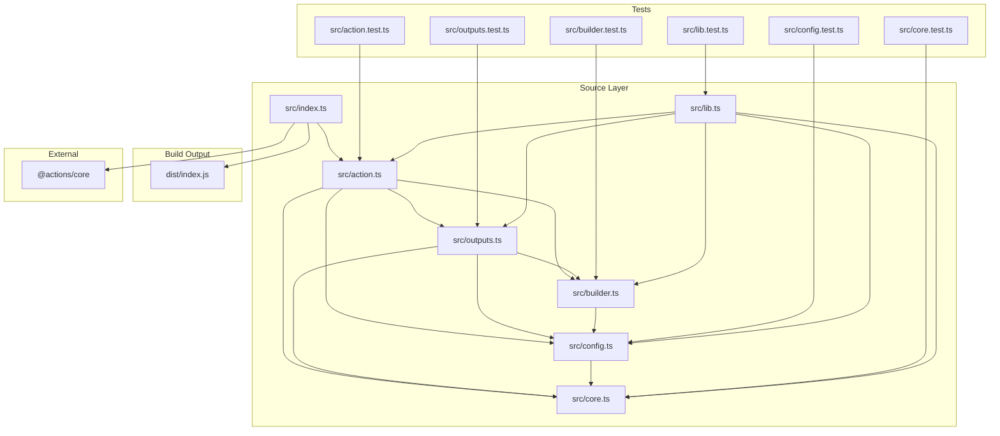
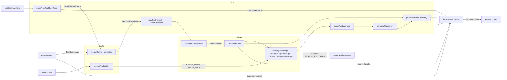
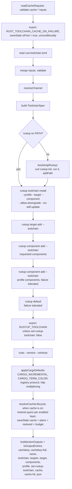
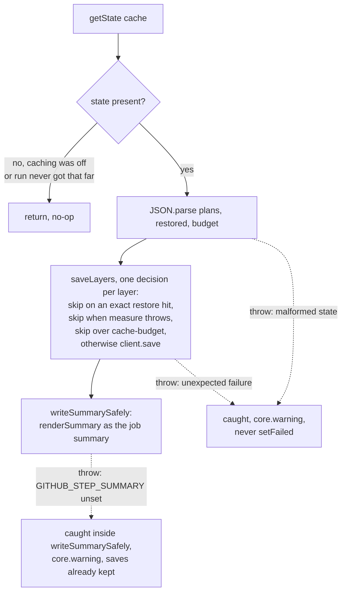
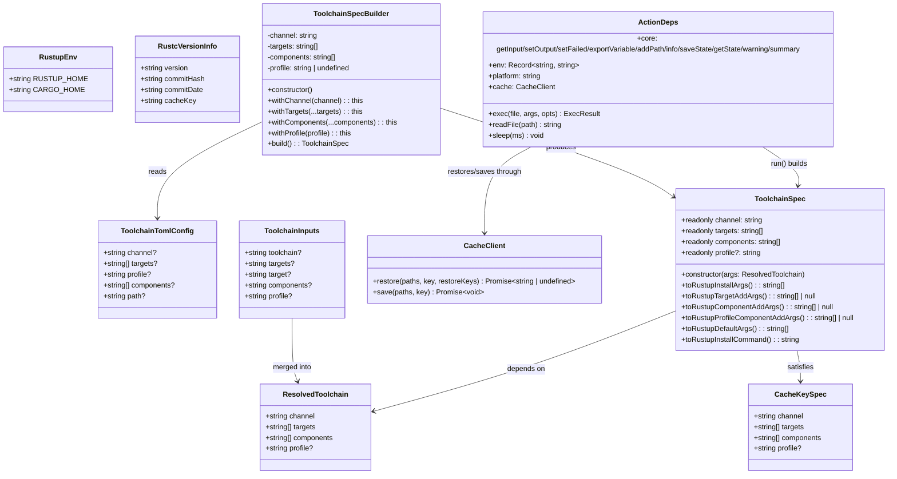
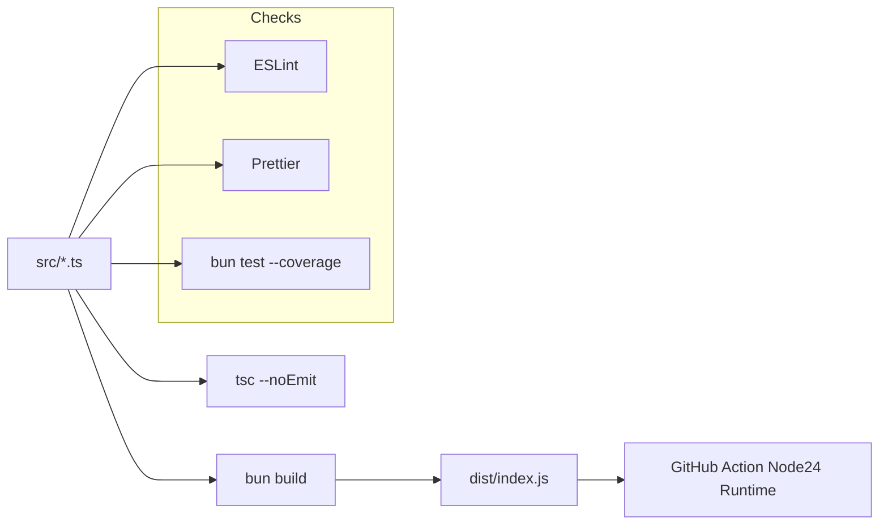
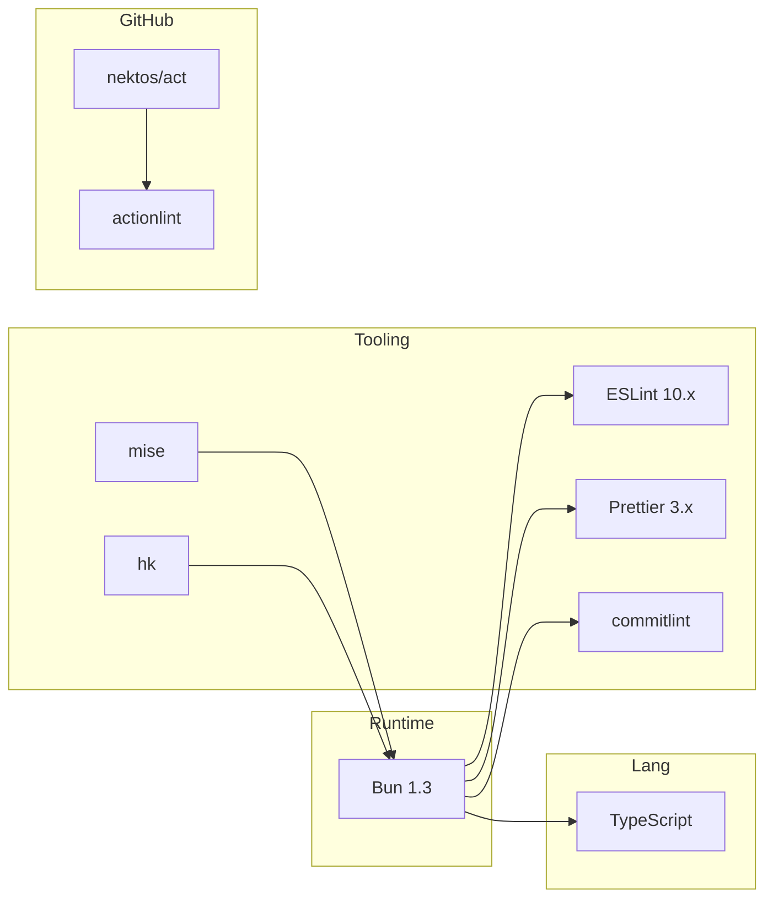

<!--
SPDX-FileCopyrightText: RUST-TOOLCHAIN contributors

SPDX-License-Identifier: MIT OR Apache-2.0
-->

# Architecture

## Overview

A TypeScript library for reading `rust-toolchain.toml` and building `rustup` toolchain install commands, designed as a GitHub Action component. Inspired by [dtolnay/rust-toolchain](https://github.com/dtolnay/rust-toolchain).

`action.yml` invokes `dist/index.js` **twice** per job — once as `main`, once
as `post` — and `src/index.ts` is the single entry point for both, dispatching
on `STATE_isPost`:

```text
GitHub Actions Runner
        |
  ┌─────┴────────┐
  │  action.yml  │  runs: node24, main AND post: dist/index.js
  └─────┬────────┘
        │
  ┌─────┴──────────────────────┐
  │  src/index.ts               │  Wiring only — dispatches on
  │  STATE_isPost === "true"?   │  STATE_isPost, set unconditionally
  └───────┬──────────┬──────────┘  by the main phase's first line
          │ no        │ yes
          v            v
  ┌───────────────┐  ┌────────────────┐
  │ run(deps)      │  │ runPost(deps)   │
  │ src/action.ts  │  │ src/action.ts   │
  └──┬───┬───┬───┬─┘  └───────┬────────┘
     │   │   │   └─────┐      │
  ┌──┘   │   └───┐     │      v
  v      v       v     v  saveLayers, then
┌──────┐┌──────┐┌───────┐┌─────────┐  writeSummarySafely
│ core ││config││builder││ outputs │  (src/cache/lifecycle.ts,
└──┬───┘└──┬───┘└───┬───┘└────┬────┘   src/cache/summary.ts)
   │       │        │         │
   └───┬───┘        │         │
       v            v         v
 ┌────────────┐┌──────────┐┌─────────────┐
 │ resolve/   ││Toolchain ││ flat keys + │
 │ merge/parse││Spec      ││ json output │
 └────────────┘└────┬─────┘└─────────────┘
                    │
                    v
     rustup install, then
     resolveCacheLifecycle:
     restoreLayers (src/cache/lifecycle.ts),
     saveState("cache", plans+restored+budget)
```

`run` (the main phase) restores every enabled cache layer after the toolchain
install and hands what it restored to the post phase through `saveState`;
`runPost` (the post phase) reads that same state back through `getState` and
saves whatever is left to save. See
[The Two Entrypoints And The State Handoff](#the-two-entrypoints-and-the-state-handoff)
below.

`src/lib.ts` sits outside this flow: it is the library barrel for programmatic
consumers, never loaded by the action itself.

## Module Dependency Graph


```mermaid
graph TD
    subgraph "Source Layer"
        A[src/core.ts]
        B[src/config.ts]
        C[src/builder.ts]
        O[src/outputs.ts]
        R[src/action.ts]
        L[src/lib.ts]
        I[src/index.ts]
    end

    subgraph "Build Output"
        E[dist/index.js]
    end

    subgraph "External"
        TK["@actions/core"]
    end

    subgraph "Tests"
        F[src/core.test.ts]
        G[src/config.test.ts]
        H[src/builder.test.ts]
        J[src/action.test.ts]
        K[src/outputs.test.ts]
        M[src/lib.test.ts]
    end

    I --> R
    I --> TK
    R --> A
    R --> B
    R --> C
    R --> O
    O --> A
    O --> B
    O --> C
    C --> B
    B --> A
    I --> E
    F --> A
    G --> B
    H --> C
    J --> R
    K --> O
    M --> L
    L --> R
    L --> A
    L --> B
    L --> C
    L --> O
```

## Data Flow


```mermaid
flowchart LR
    TOML[rust-toolchain.toml]
    INPUTS[Action Inputs]

    subgraph Core
        PARSER[parseRustToolchainToml]
        RESOLVER[resolveChannel + scaleBareMinor]
        RUSTC[parseRustcVersion]
        CACHEKEY[generateCacheKey]
        SPECKEY[generateSpecCacheKey]
    end

    subgraph Config
        MERGE[mergeConfig + validation]
        ENV[resolveRustupEnv]
    end

    subgraph Builder
        BUILDER[ToolchainSpecBuilder]
        SPEC[ToolchainSpec]
        CMD[toRustupInstallArgs / toRustupTargetAddArgs / toRustupComponentAddArgs]
    end

    TOML --> PARSER
    PARSER -->|ToolchainTomlConfig| MERGE
    INPUTS -->|ToolchainInputs| MERGE

    MERGE -->|ResolvedToolchain| RESOLVER
    RESOLVER --> BUILDER
    BUILDER -->|fluent chaining| SPEC
    SPEC --> CMD

    PROCENV[process.env] --> ENV
    ENV -->|RUSTUP_HOME / CARGO_HOME| CMD

    CMD --> RUSTC
    RUSTC --> CACHEKEY
    CACHEKEY --> OUTS[buildActionOutputs]
    CACHEKEY --> SPECKEY
    SPEC --> SPECKEY
    SPECKEY --> OUTS

    SPEC -->|resolved config| OUTS
    PARSER -->|toml provenance| OUTS
    INPUTS -->|input provenance| OUTS
    OUTS -->|flat keys + json| OUT[Action outputs]

    CMD -->|exports RUSTUP_TOOLCHAIN| STEPS[Later workflow steps]
```

## Run Sequence

`run(deps)` in `src/action.ts`, the main phase, in order. Everything below the
dashed line happens only after the toolchain is installed.


```mermaid
flowchart TD
    Z[readCacheRequest, validate cache-* inputs] --> Y[export RUST_TOOLCHAIN_CACHE_ON_FAILURE,<br/>saveState isPost = true, unconditionally]
    Y --> A[read rust-toolchain.toml]
    A --> B[merge inputs, validate]
    B --> C[resolveChannel]
    C --> D[build ToolchainSpec]
    D --> E{rustup on PATH?}
    E -->|no| F[bootstrapRustup:<br/>curl rustup-init, run it, addPath]
    E -->|yes| G
    F --> G[rustup toolchain install<br/>--profile --target --component<br/>--allow-downgrade --no-self-update]
    G --> H[rustup target add --toolchain]
    H --> I[rustup component add --toolchain<br/>requested components]
    I --> P[rustup component add --toolchain<br/>profile components, failure tolerated]
    P --> J[rustup default<br/>failure tolerated]
    J --> K[export RUSTUP_TOOLCHAIN<br/>unless set-rustup-toolchain: false]
    K -.-> L[rustc --version --verbose]
    L --> M[applyCargoDefaults:<br/>CARGO_INCREMENTAL, CARGO_TERM_COLOR,<br/>registry protocol, http multiplexing]
    M --> Q[resolveCacheLifecycle, when cache is on:<br/>restoreLayers per enabled layer,<br/>saveState cache = plans + restored + budget]
    Q --> N[buildActionOutputs + toOutputEntries:<br/>cachekey, cachekey-full, name,<br/>toolchain, targets, target, components,<br/>profile, set-rustup-toolchain, cache,<br/>cache-hit, json]
```

## Post-Phase Sequence

`runPost(deps)`, invoked by `action.yml`'s `post:` when `post-if` is true —
`success()` or `cache-on-failure: true`. It sees none of the main phase's
locals; everything it needs crossed through `saveState`/`getState`.


```mermaid
flowchart TD
    S0[getState cache] --> S1{state present?}
    S1 -->|no, caching was off<br/>or run never got that far| S2[return, no-op]
    S1 -->|yes| S3[JSON.parse plans, restored, budget]
    S3 --> S4[saveLayers, one decision per layer:<br/>skip on an exact restore hit,<br/>skip when measure throws,<br/>skip over cache-budget,<br/>otherwise client.save]
    S4 --> S5[writeSummarySafely:<br/>renderSummary as the job summary]
    S3 -.throw: malformed state.-> S6[caught, core.warning,<br/>never setFailed]
    S4 -.throw: unexpected failure.-> S6
    S5 -.throw: GITHUB_STEP_SUMMARY unset.-> S7[caught inside writeSummarySafely,<br/>core.warning, saves already kept]
```

Every `rustup` step is an argv array executed without a shell, bounded by a
timeout, and retried up to three times with 1s/2s backoff.

## Class Hierarchy


```mermaid
classDiagram
    class ToolchainTomlConfig {
        +string channel?
        +string[] targets?
        +string profile?
        +string[] components?
        +string path?
    }

    class ToolchainInputs {
        +string toolchain?
        +string targets?
        +string target?
        +string components?
        +string profile?
    }

    class RustupEnv {
        +string RUSTUP_HOME
        +string CARGO_HOME
    }

    class ResolvedToolchain {
        +string channel
        +string[] targets
        +string[] components
        +string profile?
    }

    class RustcVersionInfo {
        +string version
        +string commitHash
        +string commitDate
        +string cacheKey
    }

    class CacheKeySpec {
        +string channel
        +string[] targets
        +string[] components
        +string profile?
    }

    class ActionDeps {
        +exec(file, args, opts) ExecResult
        +readFile(path) string
        +core: getInput/setOutput/setFailed/exportVariable/addPath/info/saveState/getState/warning/summary
        +env: Record~string, string~
        +platform: string
        +sleep(ms) void
        +cache: CacheClient
    }

    class CacheClient {
        +restore(paths, key, restoreKeys) Promise~string | undefined~
        +save(paths, key) Promise~void~
    }

    ActionDeps --> CacheClient : restores/saves through

    class ToolchainSpec {
        +readonly channel: string
        +readonly targets: string[]
        +readonly components: string[]
        +readonly profile?: string
        +constructor(args: ResolvedToolchain)
        +toRustupInstallArgs(): string[]
        +toRustupTargetAddArgs(): string[] | null
        +toRustupComponentAddArgs(): string[] | null
        +toRustupProfileComponentAddArgs(): string[] | null
        +toRustupDefaultArgs(): string[]
        +toRustupInstallCommand(): string
    }

    class ToolchainSpecBuilder {
        -channel: string
        -targets: string[]
        -components: string[]
        -profile: string | undefined
        +constructor()
        +withChannel(channel): this
        +withTargets(...targets): this
        +withComponents(...components): this
        +withProfile(profile): this
        +build(): ToolchainSpec
    }

    ToolchainInputs --> ResolvedToolchain : merged into
    ToolchainSpec --> ResolvedToolchain : depends on
    ToolchainSpecBuilder --> ToolchainSpec : produces
    ToolchainSpecBuilder --> ToolchainTomlConfig : reads
    ToolchainSpec --> CacheKeySpec : satisfies
    ActionDeps --> ToolchainSpec : run() builds
```

## Source File Map

| File                     | Type                                | Exports                                                                                                                                                                                                                             | Responsibilities                                                                                                                                                                                                                                                                                                                                                                          |
| ------------------------ | ----------------------------------- | ----------------------------------------------------------------------------------------------------------------------------------------------------------------------------------------------------------------------------------- | ----------------------------------------------------------------------------------------------------------------------------------------------------------------------------------------------------------------------------------------------------------------------------------------------------------------------------------------------------------------------------------------- |
| `src/index.ts`           | Entry (node:child_process, node:fs) | none — side-effecting script                                                                                                                                                                                                        | Dependency wiring only, dispatching on `STATE_isPost`: for the main phase, hands real `spawnSync`, `readFileSync`, `@actions/core` and a synchronous `sleep` to `run()`; for the post phase, hands the real `@actions/cache` client and a `node:fs`-backed `measure()` to `runPost()`. Invisible to the coverage gate — see [Cache Lifecycle](#the-actionscache-adapter-lives-in-indexts) |
| `src/action.ts`          | Module                              | `run`, `runPost`, `ActionDeps`, `PostDeps`, `ExecResult`, `ExecOptions`                                                                                                                                                             | Main phase (`run`) — rustup bootstrap, install, targets, components, default, `RUSTUP_TOOLCHAIN`, cargo env defaults, cache-lifecycle restore, outputs. Post phase (`runPost`) — replays the state `run` saved through `saveState` and saves whatever is left to save. Argv only, timeouts, retries                                                                                       |
| `src/core.ts`            | Module (smol-toml, node:crypto)     | `parseRustToolchainToml`, `resolveChannel`, `generateCacheKey`, `generateSpecCacheKey`, `parseRustcVersion`, types                                                                                                                  | TOML parsing, channel resolution/scaling/validation, cache key computation                                                                                                                                                                                                                                                                                                                |
| `src/config.ts`          | Module                              | `mergeConfig`, `resolveRustupEnv`, `parseCommaList`, types                                                                                                                                                                          | Merge toml config with action inputs (scalars replaced by inputs; lists accumulate deduped, inputs leading) and validate identifiers; resolve `RUSTUP_HOME`/`CARGO_HOME`, honouring caller-supplied values                                                                                                                                                                                |
| `src/builder.ts`         | Classes                             | `ToolchainSpec`, `ToolchainSpecBuilder`                                                                                                                                                                                             | Fluent builder pattern, rustup argv generation                                                                                                                                                                                                                                                                                                                                            |
| `src/outputs.ts`         | Module                              | `buildActionOutputs`, `toOutputEntries`, `ActionOutputs`, `ActionOutputsArgs`, `BooleanInput`, `CacheOutputs`, `CacheLayerOutput`, provenance types                                                                                 | Maps the resolved spec plus its sources and the cache lifecycle's outcome onto the action's output surface; serialises lists as JSON arrays and the whole object as `json`                                                                                                                                                                                                                |
| `src/inputs.ts`          | Module                              | `readBooleanInput`, `InputReader`                                                                                                                                                                                                   | Shared YAML-boolean input parsing, used by both `action.ts` and `cache/inputs.ts` — belongs to neither on its own                                                                                                                                                                                                                                                                         |
| `src/cache/layers.ts`    | Module                              | `CACHE_LAYER_IDS`, `CacheLayerId`, `parseCacheLayers`                                                                                                                                                                               | The canonical layer list (`registry`, `build`) and the `cache-layers` input parser                                                                                                                                                                                                                                                                                                        |
| `src/cache/keys.ts`      | Module                              | `joinKeySegments`, `buildLayerKey`, `CacheKeyContext`, `CacheLayerKey`                                                                                                                                                              | Per-layer key and restore-key ladder derivation; the `build` key folds in `envHash`                                                                                                                                                                                                                                                                                                       |
| `src/cache/inputs.ts`    | Module                              | `readCacheRequest`, `buildCacheOutputs`, `CacheRequest`, `CacheInputSource`                                                                                                                                                         | Validates every `cache-*` input before anything installs (`readCacheRequest`, fails fast on a bad `cache-key-hash` or an oversized key); completes the validated request into per-layer keys once the spec digest exists (`buildCacheOutputs`)                                                                                                                                            |
| `src/cache/env.ts`       | Module (node:crypto)                | `hashBuildEnv`                                                                                                                                                                                                                      | Digests the `CARGO_*`/`CC`/`CFLAGS`/`CXX`/`CMAKE`/`RUST*` environment into the `build` key's `envHash` segment, so jobs differing only in `RUSTFLAGS` stop sharing a key                                                                                                                                                                                                                  |
| `src/cache/paths.ts`     | Module (node:path)                  | `parseWorkspaces`, `registryPaths`, `buildPaths`, `Workspace`                                                                                                                                                                       | Reads `cache-workspaces` into resolved `<manifest-dir> -> <target-dir>` mappings, refusing anything outside the checkout; the `registry` layer's fixed paths; the `build` layer's paths as a files-only glob set — `<target>/**` plus `!<target>/**/incremental/**`, `!<target>/**/examples/**` and the two directory negations that keep the manifest free of directories                |
| `src/cache/budget.ts`    | Module                              | `parseSize`, `measurePaths`, `StatFs`                                                                                                                                                                                               | Reads `cache-budget` into a byte count (binary suffixes, `0` disables it); sums a layer's on-disk size through an injected `StatFs` port                                                                                                                                                                                                                                                  |
| `src/cache/client.ts`    | Module                              | `CacheClient`                                                                                                                                                                                                                       | The restore/save port. The only real implementation wraps `@actions/cache` and lives in `src/index.ts`, which nothing imports and the coverage gate does not measure                                                                                                                                                                                                                      |
| `src/cache/lifecycle.ts` | Module                              | `restoreLayers`, `saveLayers`, `LayerPlan`, `RestoredLayer`, `SavedLayer`, `LayerResult`, `LifecycleLog`, `SaveArgs`                                                                                                                | Restores every enabled layer concurrently, downgrading any failure to a miss; decides whether each layer is worth saving — skip on an exact hit, skip when its size can't be measured, skip over budget — and saves the rest concurrently                                                                                                                                                 |
| `src/cache/summary.ts`   | Module                              | `renderSummary`                                                                                                                                                                                                                     | Renders the per-layer restore/save outcome as the job summary's Markdown table                                                                                                                                                                                                                                                                                                            |
| `src/lib.ts`             | Barrel                              | re-exports `action`, `builder`, `cache/budget`, `cache/client`, `cache/env`, `cache/inputs`, `cache/keys`, `cache/layers`, `cache/lifecycle`, `cache/paths`, `cache/summary`, `config`, `core`, `inputs`, `outputs` — never `index` | The library surface under one specifier, for consumers that would rather import `@rust-toolchain` than fifteen modules                                                                                                                                                                                                                                                                    |

`src/lib.ts` is the barrel; individual modules can still be imported directly
and are cheaper, since the barrel loads all fifteen.

### Why the barrel excludes `src/index.ts`

`src/index.ts` calls `run()` at the top level, so it is the one module in the
tree whose import has a side effect — it shells out to `rustup`. Keeping it out
of `src/lib.ts` is what makes that side effect unreachable to a consumer, and
`src/lib.test.ts` asserts the exclusion in source rather than trusting a comment
to survive.

### Why library source imports itself as `@rust-toolchain/*`

Every module under `src/` imports its siblings through the package specifier
(`import … from "@rust-toolchain/config"`), not through `./config` and not
through the short `@/` alias. A path alias is a _consumer-visible_ detail: when
a sibling project maps `@rust-toolchain/*` at its own root, the library's
internal imports resolve there too, because they use the very specifier the
consumer mapped. An internal-only alias breaks that — a package whose source
says `@/config` typechecks in its own repo and fails in every consumer with
`TS2307: Cannot find module '@/config'`.

`@/*` is mapped as a short form but confined to tests, which are never consumed.
It must not appear in library source: a consumer almost certainly has their own
`@/` pointing at their own `src`, so the import would resolve into their tree.

See
[README → Consuming from Another TypeScript Project](../README.md#consuming-from-another-typescript-project).

## Build Pipeline


```mermaid
flowchart LR
    SRC[src/*.ts]
    TSC[tsc --noEmit]
    BUN[bun build]
    DIST[dist/index.js]

    SRC --> TSC
    SRC --> BUN
    BUN --> DIST
    DIST --> ACTION[GitHub Action Node24 Runtime]

    subgraph Checks
        LINT[ESLint]
        FORMAT[Prettier]
        TEST[bun test --coverage]
    end

    SRC --> LINT
    SRC --> FORMAT
    SRC --> TEST
```

## Testing Strategy

All tests use Bun's built-in test runner with 100% coverage enforced by `bunfig.toml`.

| File                       | Tests                                                                                                                                                                                                 | Coverage Target                   |
| -------------------------- | ----------------------------------------------------------------------------------------------------------------------------------------------------------------------------------------------------- | --------------------------------- |
| `src/action.test.ts`       | `run` against injected fakes — argv shape, timeouts, retry/backoff, spawn errors, rustup bootstrap (POSIX + Windows), cargo env defaults, tolerated `rustup default`, `set-rustup-toolchain`, outputs | 100%                              |
| `src/core.test.ts`         | `parseRustToolchainToml`, `resolveChannel` (release-day table, bare-minor scaling, rejected names), `generateCacheKey`, `generateSpecCacheKey`, `parseRustcVersion`                                   | 100% lines, functions, statements |
| `src/config.test.ts`       | `mergeConfig` — toml vs input priority, target alias, default channel, identifier validation; `resolveRustupEnv` — env overrides, blank handling, `HOME` fallback, Windows paths                      | 100%                              |
| `src/builder.test.ts`      | `ToolchainSpecBuilder` fluent chain, `ToolchainSpec` direct construction, argv generation and batching, install flags                                                                                 | 100%                              |
| `src/outputs.test.ts`      | `buildActionOutputs` — resolved values, empty-list and absent-profile edges, `inputs`/`toml` provenance; `toOutputEntries` — JSON array serialisation, string booleans, `json` key order              | 100%                              |
| `src/cache/layers.test.ts` | `CACHE_LAYER_IDS`, `parseCacheLayers` — separators, dedup, unknown-layer and empty-selection rejection                                                                                                | 100%                              |
| `src/cache/keys.test.ts`   | `joinKeySegments` — segment collapsing; `buildLayerKey` — registry vs. build key shape, restore-key ladders                                                                                           | 100%                              |
| `src/lib.test.ts`          | Barrel surface pinned export by export, and the guard that `src/lib.ts` never re-exports `src/index.ts`; both path aliases resolve                                                                    | 100%                              |

The release-cycle cases are pinned against real rust-lang.org release dates
rather than against this codebase's own arithmetic, so a drifting epoch fails
the suite instead of being reflected by it.

## Key Design Decisions

### TOML-First, Override by Inputs

The action reads `rust-toolchain.toml` by default and merges it with action inputs. Inputs win on conflict. This mirrors the dtolnay/rust-toolchain behavior but adds explicit `profile` support.

### Fluent Builder Pattern

`ToolchainSpecBuilder` provides a fluent API with method chaining:

```ts
new ToolchainSpecBuilder()
  .withChannel("stable")
  .withTargets("wasm32-unknown-unknown")
  .withComponents("clippy", "rustfmt")
  .withProfile("minimal")
  .build();
```

### Channel Resolution

`resolveChannel` supports three expressive formats beyond literal channels:

- `stable N (year|month|week|day) ago` — compute minor from date arithmetic
- `stable minus N releases` — subtract from current stable
- `1.XX` — passed through unchanged; rustup resolves a `<major.minor>` channel to the newest patch in that series

### Cache Key

`generateCacheKey` produces a 12-character key from `date + commitHash` (first 12 chars), matching dtolnay/rust-toolchain's output format for cache compatibility. It is read through `RUSTUP_TOOLCHAIN`, so the key describes the toolchain that was requested rather than whatever a `rust-toolchain.toml` would have selected.

A `rustc` that cannot be run is fatal rather than silently yielding an empty key: every consumer keying a cache on an empty string would share one entry, with nothing in the log to explain it.

`generateSpecCacheKey` publishes a second output, `cachekey-full`, appending a
SHA-256 digest of the resolved channel, targets, components and profile. The
compatible key describes the compiler build alone, so two jobs on the same rustc
collide even when one installed `wasm32-unknown-unknown` and the other did not —
and the second restores artifacts produced without its target. Targets and
components are sorted before hashing, so the same set written in a different
order still hits the same key. See [COMPARISON.md](COMPARISON.md#cache-key).

### Cache Layers

`cache: true` derives a key and restore-key ladder per cache layer, published
through the `cache` output. Phase A shipped the keys; Phase B (below) restores
and saves against them. Two layers exist today, defined in
`src/cache/layers.ts` and keyed in `src/cache/keys.ts`:

- **`registry`** — the downloaded crate sources under `~/.cargo/registry` and
  `~/.cargo/git`. Its key is `registry-<os>-<arch>-<suffix>-<lockHash>`, and it
  deliberately omits the resolved toolchain: any rustc can compile a source
  archive it did not build, so tying the key to the compiler would force a
  re-download on every toolchain bump for no benefit.
- **`build`** — the compiled artifacts under `target/`. Its key is
  `build-<os>-<arch>-<suffix>-<specCacheKey>-<envHash>-<lockHash>`, carrying
  the resolved spec and the digest of the build-affecting environment
  (`hashBuildEnv`, `src/cache/env.ts`) because those artifacts are both
  toolchain- and environment-specific. Its restore ladder stops one rung short
  of the bare `registry`-style prefix — the ladder is
  `build-<os>-<arch>-<suffix>-<specCacheKey>-<envHash>-` and nothing looser —
  because an entry built by a different toolchain or environment is not a
  useful restore: `cargo` would discard it on sight, and the run pays the
  download cost only to re-save it under a new key regardless.

The layers are split by how often each one invalidates, which is the whole
point of separating them: a `rustc` bump invalidates `build` but not
`registry`, so splitting them stops a compiler upgrade from forcing a
re-download of every crate it never touched.

The dependency-set hash (`cache-key-hash`) is a required input rather than
something the action computes, because `hashFiles()` — the only thing that can
glob a workspace's lockfiles — is a GitHub Actions workflow-expression
function, unreachable from a Node action. Taking the workflow's own value also
keeps these keys interoperable with a hash the workflow may already use
elsewhere.

`envHash` was added after the key format above already shipped, which means it
changed every existing `build` key the moment it did: a workflow upgrading
across that boundary sees exactly one cold `build` restore, then resumes
hitting normally. See the upgrade note in [README → Deriving cargo cache keys
yourself](../README.md#deriving-cargo-cache-keys-yourself).

`cache: true` restores and saves both layers itself — see [Cache Lifecycle](#cache-lifecycle)
below. A workflow can still derive the keys alone and wire its own
`actions/cache` steps (see the [README's key-only
recipe](../README.md#deriving-cargo-cache-keys-yourself)). See
[`docs/design/2026-07-31-layered-cargo-cache.md`](design/2026-07-31-layered-cargo-cache.md)
for the full design rationale, including the `bin` layer that a later phase
adds for cargo-installed tools.

### Cache Lifecycle

`resolveCacheLifecycle` in `src/action.ts` turns the derived keys into actual
restores and saves, split across the main and post phases:

- **Restore** (`restoreLayers`, `src/cache/lifecycle.ts`) runs every enabled
  layer's `client.restore` concurrently, in the main phase, right after the
  toolchain is installed — the `build` key needs `specCacheKey`, which does
  not exist until rustc has run. Any failure — a service outage, a reserved-key
  race — becomes a warning and an ordinary miss; a cache being unavailable must
  not fail a job that would otherwise succeed.
- **Save** (`saveLayers`/`saveLayer`, `src/cache/lifecycle.ts`) runs from the
  post phase, once the whole job has finished. Three independent reasons skip
  a layer: it matched its restore key exactly (unchanged, saving it again is
  pure budget burn); its size could not be measured (`measurePaths` threw —
  writing an entry of unknown size into a shared budget is the unsafe
  direction); or its measured size exceeds `cache-budget` (an oversized entry
  does not degrade its own hit rate, it evicts _other_ workflows' caches). Each
  layer's save is independently caught, so one layer's failure cannot lose the
  results of the others in the same batch.
- **Exclusions are negation globs, never deletion — and they only work on a
  files-only manifest.** `buildPaths` (`src/cache/paths.ts`) emits
  `<target>/**`, then `!<target>/**/incremental/**` and
  `!<target>/**/examples/**`, and finally `!<target>/` and `!<target>/**/`.
  Those last two are not decoration. `@actions/cache` resolves the patterns
  through `@actions/glob` with `implicitDescendants: false`, writes the matches
  to a manifest, and runs `tar --files-from <manifest>` — with no
  `--no-recursion`. Any directory left in the manifest is therefore expanded
  wholesale by tar and re-includes everything the negations removed, so
  excluding directories is what makes the other exclusions reach the archive.
  Verified at the tar layer, not only the glob layer: the pre-fix
  `[target, !target/*/incremental, …]` form resolved to the single entry
  `target`, from which tar archived the whole tree. The cost of a files-only
  manifest is that empty directories and directory permissions and mtimes are
  not preserved, which cargo does not depend on — it decides freshness from
  file mtimes and recreates any directory it needs. Nothing on disk is touched,
  so a save failure leaves the working tree exactly as it was. `registryPaths`
  keeps naming bare directories, and that asymmetry is deliberate: it carries
  no exclusions, so tar's recursion is exactly what archives it. `registry/src`
  is excluded there by never being listed at all, since it is fully regenerable
  from the `.crate` files in `registry/cache`.
- **A cache failure never fails the build.** Restore, save, size measurement
  and the job summary write are each wrapped so their own failure produces a
  `core.warning` and lets everything else continue — including `runPost`'s
  outer `try`/`catch` around a malformed state payload, and
  `writeSummarySafely`'s own inner one around a summary write that throws when
  `GITHUB_STEP_SUMMARY` is unset (slim runners, `act`).
- **The job summary** (`renderSummary`, `src/cache/summary.ts`) is the only
  place a per-layer result is visible — `cache-hit` is a single all-layers
  boolean, so telling a cold run from a broken key needs the table naming each
  layer's actual restore result and save outcome.

### The Two Entrypoints And The State Handoff

`action.yml` declares both `main` and `post` as `dist/index.js` — the same
bundle, invoked twice. `src/index.ts` is the only place that tells the two
invocations apart, by checking `process.env.STATE_isPost`, which GitHub Actions
populates from whatever the main phase's `saveState("isPost", ...)` wrote.

That call is the first thing `run` does — unconditionally, before reading any
cache input, before installing anything — specifically so a
caching-**disabled** job's post invocation can still tell it is the post
phase. Gating it on `cache: true` was tried and reverted: on the default
configuration `STATE_isPost` would never be set, the post invocation would
fall through to `run`'s own branch in `src/index.ts`, and the whole toolchain
install would run a second time — capable of turning an already-succeeded job
into a failed one. `runPost` already no-ops correctly on empty state, which is
what makes the unconditional `saveState` safe for every configuration.

The second piece of state, `"cache"`, crosses the same boundary as a
JSON-encoded string: `{ plans, restored, budget }`, written by
`resolveCacheLifecycle` only when caching is enabled, and read back by
`runPost` through `getState("cache")`. An empty value there — caching was off,
or the run never reached the lifecycle — is `runPost`'s own no-op signal,
independent of `isPost`. Because the two phases are separate process
invocations, nothing else survives between them: no closures, no module-level
state, only what was explicitly written to and read from these two keys.

### The `@actions/cache` Adapter Lives In `index.ts`

`CacheClient` (`src/cache/client.ts`) is a two-method port —
`restore`/`save` — with no real implementation anywhere under `src/`. The only
one wraps `@actions/cache` and is built inline in `src/index.ts`, which
nothing imports and the coverage gate does not measure (see `CLAUDE.md` →
Coverage gate gotchas). That placement is deliberate, not an oversight:
`@actions/cache` vendors the Azure Storage SDK — most of the roughly 1.4 MB
this feature added to `dist/index.js` — plus genuinely unmockable network
code. A library module importing it directly would pull that weight, and that
network code, into every test process, making the 100% coverage gate
unreachable for anything downstream of it. Every module that needs to restore
or save takes a `CacheClient` as a dependency instead, so tests inject a fake
and the real adapter is exercised only by the actual GitHub Actions runtime —
and by CI's `E2E` and `E2E Warm Cache` jobs, the only place restore and save
meet the real cache service. It takes two jobs rather than one: `post:` runs
after every other step in its own job, so nothing a job saves is visible to
that same job, and the warm restore has to happen in a dependent job (see
[README → Built to be trusted](../README.md#built-to-be-trusted)).

### Toolchain Pinning

rustup resolves the active toolchain through an [override chain](https://rust-lang.github.io/rustup/overrides.html) — highest first: `+toolchain` shorthand, `RUSTUP_TOOLCHAIN`, directory override, `rust-toolchain.toml`, default. Three consequences shape this codebase:

- **`src/action.ts` exports `RUSTUP_TOOLCHAIN`** after installing. Setting `rustup default` alone is not enough: a workspace `rust-toolchain.toml` outranks the default, so later steps would run a different toolchain than the one installed.
- **`src/builder.ts` pins `--toolchain` on every `target add` / `component add`.** Without it those commands resolve through the same chain and attach targets or components to the toml's toolchain.
- **A `path` toolchain is rejected.** `path` selects a local directory and is mutually exclusive with `channel`, so there is nothing to install; `mergeConfig` throws rather than silently falling back to `stable`.

### Profiles Are Always Explicit

Omitting `--profile` makes rustup fall back to the globally configured profile (`rustup set profile`), not to `default`. The [rustup book](https://rust-lang.github.io/rustup/overrides.html) says so directly about the toolchain file's `profile` key:

> Note that if not specified, the `default` profile is not necessarily used, as a different default profile might have been set with `rustup set profile`.

Since `mergeConfig` resolves a profile for every run, `ToolchainSpec` always passes it explicitly so a runner-wide setting cannot change the result.

`mergeConfig` accepts only the three profiles rustup defines — `minimal`,
`default`, `complete` — narrowing the value to a `RustupProfile` union rather
than passing an arbitrary string through. A typo is reported with the valid
options listed instead of reaching rustup.

When neither the toml nor an input names one, the resolved value is
`DEFAULT_PROFILE`, which is **`default`** — the same profile rustup itself
defaults to (`minimal` plus `rust-docs`, `rustfmt` and `clippy`).

### The Profile Only Applies to a Fresh Toolchain

rustup silently ignores `--profile` when the toolchain is already installed.
Verified on a clean `rust:trixie` container:

```text
fresh  install --profile minimal   → installed   cargo, rust-std, rustc
re-install     --profile default   → unchanged   cargo, rust-std, rustc
re-install     --profile complete  → unchanged   cargo, rust-std, rustc
re-install     --profile default --force
                                   → unchanged   cargo, rust-std, rustc
remove, then fresh --profile default
                                   → installed   cargo, clippy, rust-docs,
                                                 rust-std, rustc, rustfmt
```

There is no rustup flag that applies a profile to an existing toolchain —
`--force` does not do it. Explicitly named components _do_ still install, which
is why the action adds `components` through separate `rustup component add`
calls rather than relying on the install flags.

### `complete` Is Not Installable on Release Channels

The `complete` profile pulls in `miri` and `rustc-codegen-cranelift`, which rustup
publishes only for nightly. On a fresh install against any release channel it
fails outright — verified for both a pinned version and `stable`:

```text
rustup toolchain install --profile complete 1.95
  error: some components are unavailable for download for channel '1.95':
         'miri' for target 'x86_64-unknown-linux-gnu',
         'rustc-codegen-cranelift' for target 'x86_64-unknown-linux-gnu'

rustup component list --toolchain 1.95    # what release channels actually offer
  llvm-tools, rust-analyzer, rust-src     # no miri, no cranelift
```

The failure is deterministic, so retrying cannot help. `assertProfileAvailable`
therefore rejects `complete` up front for any channel that is not nightly,
before a single rustup command runs — turning a slow, opaque network failure
into an immediate message naming the cause and the two ways out. The check runs
on the _resolved_ channel, so `stable 2 releases ago` is judged as the release
it becomes.

`beta` is rejected along with the release channels: a fresh container lists
neither component for it.

On an already-installed toolchain `complete` appears to succeed purely because
the profile is ignored (see above) — nothing is resolved, so nothing can be
missing. That is why the check is on the channel rather than on the outcome.

Because `complete` requests the widest set, `--allow-downgrade` is added for it
on `nightly` — the same latitude explicitly named components get, letting rustup
step back to the newest nightly that carries everything.

### Profiles Are Expanded Into Components

Because rustup will not apply a profile to an existing toolchain, the action
adds the profile's components by name after installing. `PROFILE_COMPONENTS` in
`src/config.ts` holds the mapping:

| Profile    | Added explicitly                                                  |
| ---------- | ----------------------------------------------------------------- |
| `minimal`  | nothing — rustc, cargo and rust-std are inherent to any toolchain |
| `default`  | `rust-docs`, `rustfmt`, `clippy`                                  |
| `complete` | the above plus `rust-src`, `rust-analyzer`, `llvm-tools`          |

`complete` deliberately omits `miri` and `rustc-codegen-cranelift`. rustup
publishes them for nightly only, so naming them would fail the add on every
release channel; they still arrive through `--profile complete` on a fresh
nightly install.

The two component invocations carry different weight:

- **Requested components** (`components:` input or toml) are a hard requirement.
  A failure fails the step.
- **Profile components** are best-effort. They were implied rather than asked
  for, so a channel that does not publish one is logged and the run continues.

Components the caller already listed are filtered out, so nothing is requested
twice.

Together with `default` as the default profile, this means a job on a runner
with Rust pre-installed still ends up with rustfmt and clippy — which is what
the profile promised and what rustup alone would not have delivered.

### Bootstrapping rustup

Self-hosted runners and slim container images frequently ship without rustup. If
`rustup --version` does not answer, `bootstrapRustup` downloads `rustup-init`
(`sh.rustup.rs`, or `win.rustup.rs/<arch>` on Windows) to `$RUNNER_TEMP`, runs it
with `--default-toolchain none`, and puts `$CARGO_HOME/bin` on `PATH`. The
installer is written to a file and executed directly rather than piped into a
shell.

### Cargo Environment Defaults

After the toolchain is installed, `applyCargoDefaults` sets what a Rust CI job
almost always wants, and never overwrites a value the workflow set itself:

| Variable                              | Value                                     | Why                                                                                                                                     |
| ------------------------------------- | ----------------------------------------- | --------------------------------------------------------------------------------------------------------------------------------------- |
| `CARGO_INCREMENTAL`                   | `0`                                       | Incremental artifacts never survive to the next run; producing them only costs time and cache space                                     |
| `CARGO_TERM_COLOR`                    | `always`                                  | Colour in the job log                                                                                                                   |
| `CARGO_REGISTRIES_CRATES_IO_PROTOCOL` | `sparse` on 1.68–1.69, `git` on 1.66–1.67 | The sparse registry was implemented in 1.66, stabilised in 1.68 and made default in 1.70, so only the versions in between need steering |
| `CARGO_HTTP_MULTIPLEXING`             | `false` on 1.70–1.71                      | Those toolchains bundle curl 8.0, which produced spurious network errors with multiplexing on                                           |

### Anchoring the Release Cycle

`stable N ago` and `stable minus N releases` count six-week cycles from
2015-05-14 — the same day dtolnay/rust-toolchain uses. The anchor is load-bearing
in both directions: a week late names a release that has been superseded, and a
week early names one that has not shipped, so `rustup toolchain install` fails
outright. `stableMinorAtDate` works purely in absolute epoch milliseconds and
`setUTC*` accessors, so the result never depends on the runner's timezone.

A bare `1.N` is scaled by `scaleBareMinor` while the scaled value names a release
that already exists: `1.9` reads as `1.90`, `1.62` is left alone. Without it,
writing `1.9` silently pins the 2015 release.

### Argv, Never a Shell

Channel, targets, components and profile can all originate in a
`rust-toolchain.toml` belonging to the checked-out workspace, which on
`pull_request_target` or any untrusted checkout is attacker-controlled. Every
command is therefore built as an argv array by `ToolchainSpec` and executed
without a shell, so a value like `stable; curl … | sh` reaches rustup as one
(invalid) toolchain name instead of a second command.

Two validation layers back this up: `resolveChannel` rejects anything that
cannot name a toolchain, and `mergeConfig` rejects targets, components and
profiles that are not plain rustup identifiers. Neither is load-bearing on its
own — they turn a confusing rustup error into a clear one.

### Timeouts and Retries

Every rustup verb used here downloads from `static.rust-lang.org`. Each call is
bounded by a timeout (10 minutes for rustup, 30 seconds for `rustc --version`)
so a stalled connection cannot hold the job until the workflow's own limit, and
network-bound commands are retried up to three times with 1s/2s backoff so a
single dropped connection does not fail the run.

### Relocatable `RUSTUP_HOME`

`resolveRustupEnv` honours a caller-supplied `RUSTUP_HOME`/`CARGO_HOME` and only falls back to `$HOME/…`. This matters on overlayfs-backed container runtimes (Docker, `act`, container jobs): rustup renames a component's _directory_ into `$RUSTUP_HOME/tmp` before replacing it, and overlayfs rejects renaming a directory that still lives in a lower image layer with `EXDEV`. Pointing `RUSTUP_HOME` at a directory created at run time keeps every rename inside one layer.

## Tooling Stack


```mermaid
flowchart LR
    subgraph Runtime
        BUN[Bun 1.3]
    end

    subgraph Lang
        TS[TypeScript]
    end

    subgraph Tooling
        MISE[mise]
        LINT[ESLint 10.x]
        FMT[Prettier 3.x]
        HK[hk]
        COMMITLINT[commitlint]
    end

    subgraph GitHub
        ACTION[actionlint]
        ACT[nektos/act]
    end

    BUN --> TS
    MISE --> BUN
    BUN --> LINT
    BUN --> FMT
    BUN --> COMMITLINT
    HK --> BUN
    ACT --> ACTION
```

### Runtime Dependencies

| Package           | Purpose                                     |
| ----------------- | ------------------------------------------- |
| `@actions/core`   | Inputs, outputs, `exportVariable`, failures |
| `@actions/github` | Workflow context                            |
| `smol-toml`       | `rust-toolchain.toml` parsing               |
