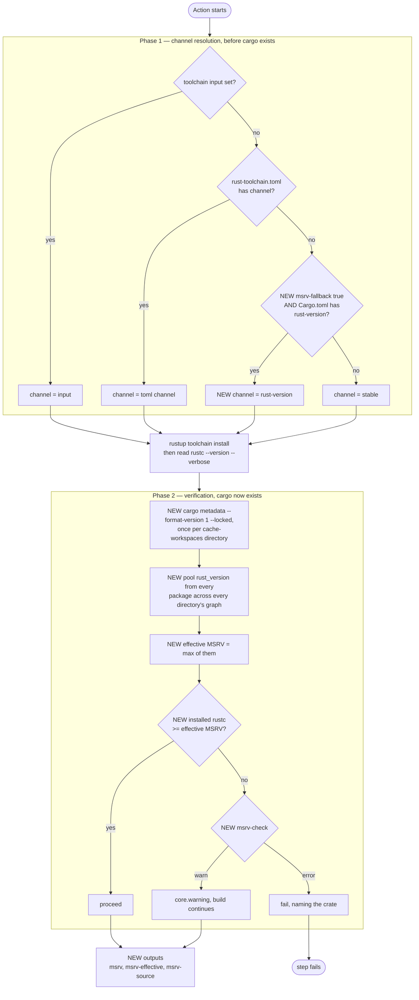

<!--
SPDX-FileCopyrightText: RUST-TOOLCHAIN contributors

SPDX-License-Identifier: MIT OR Apache-2.0
-->

# MSRV Awareness — Design

Status: implemented
Date: 2026-08-12
Implemented: 2026-08-12

## Summary

Teach the action about `rust-version`, the minimum supported Rust version a crate declares in `Cargo.toml`. Today
nothing in `src/` reads `Cargo.toml` at all: `readTomlConfig` (`src/action.ts:221`) opens exactly one file,
`rust-toolchain.toml`, and the channel resolves as `inputs.toolchain ?? tomlConfig.channel ?? "stable"`
(`src/config.ts:225`). A repository with `rust-version = "1.88"`, no toolchain input and no `rust-toolchain.toml`
therefore builds on `stable`, silently.

Two independent capabilities, deliberately separate inputs because they read different sources at different times:

- **`msrv-check`** (`off` / `warn` / `error`, default `warn`) — after the toolchain is installed, compare the
  installed `rustc` against the **effective MSRV** of the resolved dependency graph, and report a violation naming
  the crate responsible. Runs over every directory named by `cache-workspaces` (default the checkout root alone), not
  the root manifest only — a monorepo whose crates live under `crates/a`, `crates/b` is checked in every one of them,
  with the packages pooled and evaluated once, since one installed toolchain compiles all of them.
- **`msrv-fallback`** (boolean, default `false`) — when neither an input nor `rust-toolchain.toml` names a channel,
  derive it from `Cargo.toml`'s `rust-version` instead of falling through to `stable`.

Plus three outputs — `msrv`, `msrv-effective`, `msrv-source` — so a downstream job can build a matrix from values
this action already computed.

Each output has exactly one source, so neither can drift into meaning the other:

| output           | defined as                                                                                                       | read in                   |
| ---------------- | ---------------------------------------------------------------------------------------------------------------- | ------------------------- |
| `msrv`           | `rust-version` in the workspace-root `Cargo.toml` — `[package]`, or `[workspace.package]` for a virtual manifest | Phase 1, `smol-toml`      |
| `msrv-effective` | the maximum `rust_version` across every package in the locked graph of every `cache-workspaces` directory        | Phase 2, `cargo metadata` |
| `msrv-source`    | `cargo-toml`, `workspace-inherit`, or `none`                                                                     | Phase 1                   |

`msrv` is deliberately the **root manifest only**, not a maximum over workspace members or `cache-workspaces`
directories. Phase 1 runs before cargo exists, so member globs cannot be expanded without reimplementing cargo's own
workspace resolution. The check does not share that constraint — Phase 2 runs after the toolchain install, so `cargo
metadata` is available and is run once per `cache-workspaces` directory (default the checkout root alone). A member
declaring a higher `rust-version` than the root is still caught within one workspace's own graph, and a monorepo's
crate under `crates/a` with its own `Cargo.toml` is caught too, because `cache-workspaces` names that directory
separately — both land in `msrv-effective`, which is the maximum across every directory's pooled packages, evaluated
once since one installed toolchain compiles all of them.

## Why the effective MSRV is the point

A crate's declared `rust-version` says nothing reliable about what it takes to build. Measured while testing the
`cargo-tools` input on 2026-08-12:

```text
cargo-binstall 1.21.1   declares rust-version = 1.79
  └─ vergen 10.0.1      requires rustc 1.95.0
  └─ cargo-platform 0.3.3  requires rustc 1.91
  └─ fs-lock 0.1.16     requires rustc 1.89.0
```

Under `--locked` the pinned graph is what binds, so the real floor is **1.95** — sixteen minor versions above the
number the crate advertises. A check that read only the workspace's own `rust-version` would have passed this and
then failed to compile. This is the entire reason the design walks the graph rather than the manifest.

It is also why `msrv` and `msrv-effective` are two outputs rather than one. Publishing a single number means a
downstream matrix reads `1.79`, installs it, and fails — in exactly the situation the feature exists to detect.

## Non-goals

- **Installing a second toolchain.** The action installs one toolchain, as it does today. Verification is a version
  comparison, not a second build.
- **Building twice.** An MSRV job that actually compiles under the MSRV is a workflow matrix concern — one job per
  toolchain, each calling this action with a different `toolchain` input, which already works and already yields
  clean per-toolchain `build` cache keys. Folding that inside one job duplicates the matrix and, as
  **Cache interaction** below shows, makes the cache materially worse.
- **Writing `rust-version` back.** Nothing is ever written to `Cargo.toml`. This is what keeps `smol-toml`
  sufficient; format-preserving round-trips would need a real TOML tool such as `taplo`.
- **Resolving MSRV-aware dependency versions.** Cargo's own MSRV-aware resolver picks compatible versions; this
  feature only reports on the graph that resolution already produced.

## Architecture



The two phases cannot be merged, and the reason is an ordering constraint rather than a preference. Phase 1 runs
**before any toolchain exists**, so the only thing readable is `Cargo.toml` parsed directly; `cargo metadata` cannot
run, because there is no cargo yet and which cargo to install is the question being answered. Phase 2 runs after the
install, which is the only point at which the locked graph is available.

Consequently the convenience default and the verification check read different sources — the workspace manifest and
the resolved graph — and a design that tried to share one source would have to give up either the fallback or the
graph walk.

## Components

### `src/msrv.ts` (new)

Pure functions, no I/O, following `src/core.ts`'s shape:

- `parseCargoManifest(contents: string): ManifestMsrv` — `smol-toml` parse returning
  `{ rustVersion?: string; source: "package" | "workspace" | "none" }`. Handles workspace inheritance: a member with
  `rust-version.workspace = true` takes the value from `[workspace.package]` at the root, and a naive read returns
  `{ workspace: true }` rather than a version. This is the one parsing trap.
- `parseVersion(value: string): Version` — `major.minor[.patch]` into numbers.
- `compareVersions(a: Version, b: Version): number` — numeric per component. Never lexical: `"1.9"` sorts above
  `"1.10"` as a string and below it as a version.
- `effectiveMsrv(packages: PackageMsrv[]): MsrvRequirement | undefined` — the maximum, carrying the package that
  demands it so the message can name it.

Reads TOML with `smol-toml`, matching the rule in `AGENTS.md` and `src/core.ts`. A TOML CLI was considered and
rejected: Phase 1 would need the tool before a toolchain exists to install it, and a subprocess is the dependency
shape this codebase quarantines in `src/index.ts` to keep the coverage gate reachable.

### `src/cache/metadata.ts` (extended)

`RawPackage` gains `rust_version`, and a new `parsePackageMsrv` returns `{ name, version, rustVersion }` per package.
`parsePackageSet` is untouched — pruning does not care about MSRV, and the two parses stay independent.

### `src/action.ts` (extended)

- Phase 1: when `msrv-fallback` is on and neither source names a channel, read `<workspace>/Cargo.toml`.
- Phase 2: after `readRustcVersion`, run the check. **`metadata` must be wired into `run`'s `ActionDeps`** — today
  `src/index.ts:142` injects it into `runPost` only, so this is new wiring, not a reuse.
- `checkMsrv` takes the list of manifest directories `cache-workspaces` names — the same list `computeKeepSet`
  already walks for pruning, read through `cacheRequest.workspaces` when caching is on, or a direct
  `readCacheWorkspaces` parse when it is off, since MSRV checking and caching are independent inputs and gating one
  behind the other would silently narrow the check to one directory for every consumer who runs with caching off,
  which is most of them until they opt in. A directory with no `Cargo.toml` is skipped before `cargo metadata` is
  ever invoked for it; one whose `cargo metadata` fails warns _naming that directory_ and the others still
  contribute — a monorepo needs to know which crate broke the check, and one bad directory must not silence every
  other one's contribution. Every directory's packages are pooled and evaluated once, since one installed toolchain
  compiles all of them.

### `action.yml` / `src/outputs.ts`

Two inputs and three outputs, all also present in the `json` object, as every other output is.

## What we compare against

**The installed `rustc` version, not the channel string.** `readRustcVersion` (`src/action.ts:706`) already runs
`rustc --version --verbose` and parses it. That makes `stable`, `beta`, `nightly-2025-01-01` and `1.88` comparable
uniformly, with no need to resolve channel names to numbers ourselves — and it compares what will actually build the
code rather than what was asked for.

## Degradation

A verification feature that silently skips is worse than none, so the two failure modes are reported differently:

| situation                                                             | behaviour                                                                                                          |
| --------------------------------------------------------------------- | ------------------------------------------------------------------------------------------------------------------ |
| Violation found                                                       | obey `msrv-check`; the message names the crate, its version, and the requirement                                   |
| No directory named by `cache-workspaces` has a `Cargo.toml`           | silent skip, no warning, `cargo metadata` never runs                                                               |
| One directory's `cargo metadata` failed — no lockfile, a broken graph | **always warn, never fail**, even under `error`; the message names that directory, and the others still contribute |
| No `rust-version` anywhere in the pooled graph                        | `msrv-effective` empty, check skipped, one warning                                                                 |

Inability to verify is not a violation. Conflating them would make `msrv-check: error` fail every repository without
a lockfile. A directory with no `Cargo.toml` at all is the one case that stays silent even under `error`: there was
never anything to check there, which is a different fact from "the check was expected to work and could not".

## Cache interaction

The three layers are keyed differently on purpose, and the difference is what keeps this safe:

| layer      | keyed on toolchain       | consequence                                                    |
| ---------- | ------------------------ | -------------------------------------------------------------- |
| `build`    | yes, via `cachekey-full` | two toolchains yield two keys; no collision                    |
| `registry` | **no**, deliberately     | shared, and correct — crate sources compile under any rustc    |
| `bin`      | **no**, deliberately     | shared, and correct — rustup shims are excluded from the layer |

Because this design installs exactly one toolchain, none of that changes. The hazard it avoids is worth recording:
had the action compiled with two toolchains into one `target/`, the keys would still not collide, but the
**directory** would hold artifacts from both, and each layer would pay upload and download for the other's bytes
forever. Nothing corrupts — cargo ignores artifacts whose fingerprint does not match — but the waste is permanent,
and pruning's attribution through `target/<profile>/.fingerprint/` gets noisier. Anyone revisiting the second-build
idea needs a separate `CARGO_TARGET_DIR` per toolchain plus a matching `cache-workspaces` entry; distinct keys alone
are not enough.

## Risks

**A new main-phase `cargo metadata` call, once per `cache-workspaces` directory.** Each needs its own `Cargo.lock`,
and every one of them must run after the `registry` layer restores or it may fetch the index. This is real added
cost on every run where `msrv-check` is on, scaling with the directory count, which is why the check is skippable
with `off` and why an unavailable graph degrades to a warning rather than an error.

**Dependency MSRV drift.** A green build can turn red after an unrelated `cargo update` pulls a dependency with a
higher `rust-version`. That is the check working, but it will surprise people; the `warn` default softens the
landing.

**`--locked` is load-bearing.** Without it, metadata may resolve versions the build will not use, and the check would
verify a graph nobody compiles.

**`msrv-fallback` changes which toolchain is installed.** This is why it defaults to `false`: on by default, every
existing user with `rust-version` and no `rust-toolchain.toml` silently moves from `stable` to their MSRV — a change
that surfaces months later as "why is CI on 1.75?". `rust-version` is a floor, not a pin; `rust-toolchain.toml` is a
pin, not an MSRV. Conflating them is the central hazard this feature must not introduce.

## Testing

- Unit, `src/msrv.test.ts`: manifest parse including workspace inheritance and a missing `rust-version`; numeric
  comparison with the `1.9` vs `1.10` case explicitly; `effectiveMsrv` over a graph where a dependency exceeds the
  workspace, using the measured `cargo-binstall` / `vergen` numbers as the fixture.
- Unit, `src/action.test.ts`: the policy matrix — `off` / `warn` / `error` × violation / no violation / cannot
  determine — plus fallback on and off with each combination of input and toml.
- Unit, `src/action.test.ts`, `describe("msrv-check across cache-workspaces directories")`: the maximum across two
  directories regardless of which one is higher; a directory with no manifest skipped silently while the other still
  runs; no directory anywhere having a manifest; one directory's `cargo metadata` failing while the other still
  contributes, naming the failed directory in the warning; a violation originating in a non-root directory failing
  under `error`; and `off` calling `metadata.read` zero times across several directories. Caching stays off
  throughout these, since that is the default and `cacheRequest.workspaces` does not exist in that case —
  `readCacheWorkspaces` is what the check falls back to.
- `metadata` is already a port, so no subprocess is needed in tests.
- One case in `.github/workflows/tests/act.yml` exercising a real graph end to end.

## Success criteria

1. With `rust-version` present and no other source, `msrv-fallback: true` installs that version and
   `msrv-source` reports `cargo-toml`; with the flag off, `stable` is installed and behaviour is byte-identical to
   today.
2. A graph whose dependency requires more than the installed toolchain produces a violation naming that dependency,
   and `msrv-check: error` fails the step while `warn` does not.
3. `msrv` and `msrv-effective` differ on the `cargo-binstall` fixture, and both appear in `json`.
4. A repository with no lockfile warns and succeeds under `msrv-check: error`.
5. 100% coverage holds and `hk check --all` stays green.
6. A monorepo whose crates live under directories named by `cache-workspaces` — not the checkout root — is checked in
   every one of them, with no dependency on `cache` being enabled.

## Monorepo awareness — closed

The first shipped version of `checkMsrv` ran `cargo metadata` against exactly one directory —
`deps.env.GITHUB_WORKSPACE ?? "."` — regardless of `cache-workspaces`. A monorepo whose crates live under `crates/a`,
`crates/b` therefore got no MSRV check at all: `cargo metadata` at the repo root either fails (no `Cargo.toml` there)
or resolves a graph nobody meant to check. This was a recorded limitation, not a design decision, and it is now
closed: `checkMsrv` takes the list of manifest directories `cache-workspaces` names, pools every directory's packages
that has a `Cargo.toml`, and evaluates the maximum once — the same list `computeKeepSet` already walks for pruning.

The one wrinkle is that `cacheRequest.workspaces` only exists when `cache` is enabled — the common default is
`cache: false`, and `readCacheRequest` returns `undefined` before it ever parses `cache-workspaces` in that case. The
check therefore falls back to a direct `readCacheWorkspaces` parse (`src/cache/inputs.ts`) whenever `cacheRequest` is
`undefined`, so MSRV coverage never depends on caching being turned on. `msrv` and `msrv-source` are unaffected by any
of this — they stay root-manifest-only, for the reason given above: Phase 1 runs before cargo exists, so member globs
and `cache-workspaces` entries alike cannot be expanded without reimplementing cargo's own workspace resolution.

## Decided

The defaults are **`msrv-fallback: false`** and **`msrv-check: warn`**, confirmed 2026-08-12. Both are chosen so
that an existing workflow sees no behaviour change on upgrade and adopts either capability explicitly.

`false` for the fallback is the load-bearing one: it is what prevents a repository with `rust-version` and no
`rust-toolchain.toml` from silently moving off `stable`. `warn` for the check means a dependency bump that raises
the graph's floor surfaces as a warning rather than a red build, which is the right default for something whose
input can change without the repository changing.
